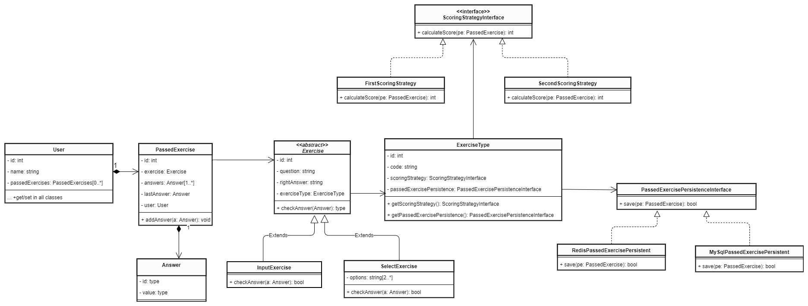
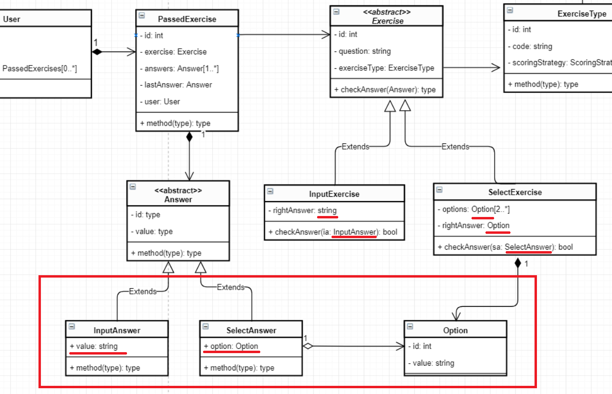

# Задание

На странице присутствуют упражнения, которые выполняет ученик. Упражнение — это некий интерактивный элемент с правильными/неправильными ответами, например:

* <select\>, в котором ученик должен выбрать правильный ответ (ответ проверяется автоматически при выборе) <br/>
* <input\>, где ученик вписывает правильный ответ (есть кнопка для проверки ответа)

Задача — реализовать архитектуру классов для системы, описанной ниже. Код не обязательно должен запускаться: не нужно верстать, реализовывать сохранение и т.д. Достаточно показать общую структуру классов, их методы и зависимости.<br/>

* Нужно сохранять состояние упражнений в хранилище. Состояние — последний ответ пользователя + история всех ответов.
* Способов сохранения упражнений может быть несколько (например, в базу данных, redis и т.д.) и они могут со временем меняться. Нужно предусмотреть возможность быстрой смены способа сохранения для одного или нескольких типов упражнений.
* Нужно рассчитывать и выводить итоговый балл на странице (простая сумма баллов за каждое упражнение). Всего существует 2 способа подсчета баллов для упражнения:<br/>
    * 10 баллов, если последний ответ верный. 0 баллов, если неверный.
    * 10 баллов, если последний ответ верный и это была единственная попытка. 5 баллов, если последний ответ верный, но это не первая попытка. 0 баллов, если последний ответ неверный.
* Должна быть возможность легко заменить способ подсчета баллов у любого из типов упражнений или добавить новое упражнение с другим способом подсчета.

## Установка

Выкачать репозиторий и выполнить команду

```console
composer install
```

## Для тестового запуска

```console
php bin/console app:test
```

Основная точка входа: src/Console/TestConsole test method

## Проектирование архитектуры классов

На данный момент рассматриваем слой бизнес объектов (BO), окончания классов опущены. 

Для начала выделим основные сущности.  
**AExercise** - абстрактное упражнение.  
Упражнения могут быть двух конкретных типов:  
* **InputExercise** - упражнение с input
* **SelectExercise** - упражнение с select

Отличие SelectExercise от InputExercise в том, что у Select есть варианты ответов (options).  
Также у них отличается логика проверки правильности ответа - метод *checkAnswer*.

**User** - пользователь системы, который проходит упражнения.  
**PassedExercise** - пройденное упражнение конкретным пользователем, это связь между пользователем, упражнением и ответами пользователя (answers):  
**Answer** - ответ пользователя. Строковое представления ответа.  

Вариант подчета очков - это явная стратегия.  
Эти классы отвечают за логику подсчета, поэтому выделяем их в пакет Business.  
Выделяем базовый интерфейс в **ScoringStrategyInterface**. И имплементируем их в классах:
* **FirstScoringStrategyBusiness** - 1 вариант из задания.
* **SecondScoringStrategyBusiness** - 2 вариант из задания.  

Вариант сохранения пройденных упражнений тоже похож на стратегию.
Выделяем абстрактный базовый класс **APassedExercisePersistenceBusiness**. И наследуемся от него:
* **MySqlPassedExercisePersistenceBusiness** - сохранение в БД.  
* **RedisPassedExercisePersistenceBusiness** - сохранение в Redis.  

Нам известно, что у каждого типа упражнения может быть своя стратегия подсчета очков и способа сохранения.
Для упрощения создания упражнений делаем фабрику.  
Выделяем абстрактный базовый класс **AExerciseCreatorBusiness**. Наследуемся от него:
* **InputExerciseCreatorBusiness** - отвечает за создание **InputExercise**
* **SelectExerciseCreatorBusiness** - отвечает за создание **SelectExercise**

Для того чтобы абстрактный фабричный метод **createExercise** имел одинаковые параметры создания для разных типов упражнений
(SelectExercise необходимы также options), сделаем абстрактный базовый класс **AExerciseConfig**. Пронаследуемся от него:
* **InputExerciseConfig** - конфиг для создания InputExercise
* **SelectExerciseConfig** - конфиг для создания SelectExercise

Информация о способе подсчета очков и методе сохранения пройденных упражнений зависит от типа упражнений.
Выделяем класс **ExerciseType**  
Также этот класс будет хранить код упражнения.  

*Скорее всего данная информация будет сохранена в БД.*  
В БД будет храниться привязка типа упраженения к его scoring strategy и persistence.  
При конвертации объектов Persistence Object(PO) в Business Object(BO) привязки будут заменяться на соответствующие ссылки бизнес объектов (сервисов).  
Таким образом можно будет легко манипулировать стратегией подсчета очков и сохранения у разных типов упражнений.

Для валидации модели проектируемых классов в разрезе работы с БД быстро накидаем PO оъекты.

Диаграмма с основными классами представлена на рисунке ниже.



<br />

*На данном этапе пропускается оптимизация БД.
Option в SelectExercise получается дублируется в объекте Answer.  
Дешевле хранить id опции в объекте Answer.  
Улучшенная структура выглядела бы так.*


